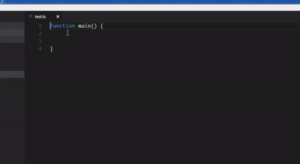

# commentimg README

Sometimes it is much easier to explain something by drawing a picture. This extension
allows you to put references to pictures in your code as pop-up images.

## Workflow
Inside a comment write
```
<cmg path_to_your_iamge>
```



Only images with extension `png`, `svg` and `jpg` are accepted. In filenames the following
characters are allowed:

 - characters small and big
 - numbers
 - dots
 - minus signs
 - for pathes slash and backslash
 - underscore

### devcontainer

to use in devcontainer, two options are there:

#### commentimg.workspace_path_override

override outside workspace path, from where the workspace is mounted inside the container. this option should be set in .vscode/settings.json in project.

#### commentimg.home_dir_override

override outside homedir for this extension, so path above can be given relative to home dir. This option should be set in homedir settings.json.


### Bad stuff
It's not possible to put images directly in the code as it's implemented
as textarea.
